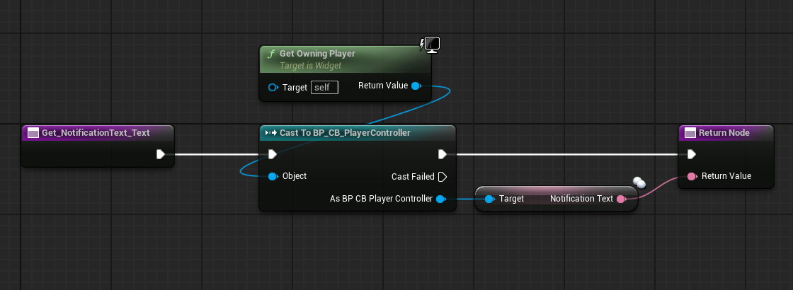
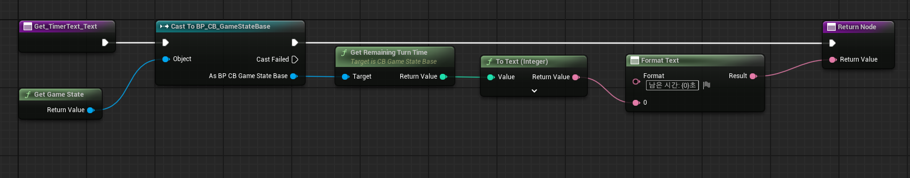
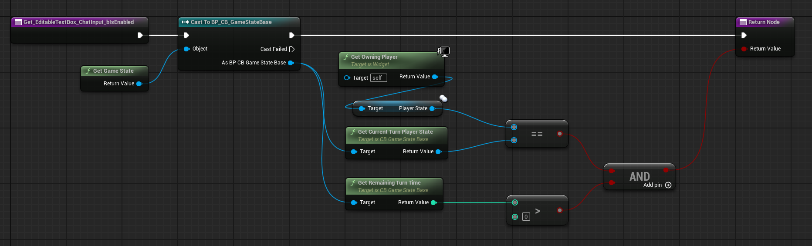

# ChattingBaseball ⚾

언리얼 엔진 5.5 기반 **멀티플레이 숫자 야구(Number Baseball)** 게임입니다.
플레이어들이 채팅창에 숫자를 입력하면 서버가 정답과 비교해 **Strike / Ball / OUT** 판정을 내리고,
턴제로 진행되며 먼저 **3 Strike**를 맞춘 플레이어가 승리합니다.

- **엔진 버전:** Unreal Engine 5.5
- **프로젝트명 / 클래스 접두사:** `ChattingBaseball` / `CB_`
- **네트워크 구조:** Listen Server 권위 모델 (서버에서 모든 판정·정답 관리, 클라이언트는 입력/표시만)

> ⚠️ PIE 테스트 시 **Editor Preferences → Play → "Run Under One Process" 체크 해제** 후 실행하세요.
> 한 프로세스로 실행하면 `GEngine`의 온스크린 메시지가 공유되어 채팅이 인원수만큼 중복 표시됩니다(엔진 특성).

---

## 클래스 구조

| 클래스 | 역할 |
| --- | --- |
| `ACB_GameModeBase` | **서버 전용.** 정답 생성, 입력 검사, S/B/OUT 판정, 승리·무승부·리셋, 턴 제어 |
| `ACB_GameStateBase` | **전 클라이언트 복제.** 남은 시간·현재 턴 플레이어 복제, 접속 알림 Multicast |
| `ACB_PlayerController` | 채팅 입력 송신/수신, 화면 출력, 공지(`NotificationText`) 복제 |
| `ACB_PlayerState` | 플레이어 이름, 현재/최대 시도 횟수, `GetPlayerInfoString()` Getter |
| `ACB_Pawn` | 네트워크 역할(NetMode/Role) 디버그 출력 |
| `UCB_ChatInput` | 채팅 입력 UMG 위젯 (`EditableTextBox` 바인딩) |
| `ChatXFunctionLibrary` | 네트워크 디버깅 헬퍼 (`MyPrintString`, `GetNetModeString`, `GetRoleString`) |

### 채팅/판정 흐름
```
[클라] UCB_ChatInput::OnChatInputTextCommitted
   └▶ ACB_PlayerController::SetChatMessageString  (원본 입력만 전송)
        └▶ ServerRPCPrintChatMessageString  ── 네트워크 ──▶ [서버]
              └▶ ACB_GameModeBase::PrintChatMessageString
                    ├ 유효성 검사 / 턴·시간 검사
                    ├ 시도 횟수 증가 → 접두사 생성
                    ├ 판정(JudgeResult) → 전체에게 ClientRPC 방송
                    └ 승패 판정(JudgeGame) → 턴 전환 / 게임 리셋
```

---

## ✅ 필수 구현 기능

### 1. GameModeBase의 판정 로직
- [x] **기본적인 멀티플레이 채팅** — `ChatInput → ServerRPC → GameMode → 전체 ClientRPC 방송` 구조로, 한 플레이어의 입력이 모든 접속자 화면에 표시됩니다.
- [x] **정답 숫자 3자리 생성** — `GenerateSecretNumber()`에서 0~9를 만든 뒤 **0을 제외(1~9)**, 매번 무작위 인덱스를 뽑고 제거해 **중복 없는 3자리**를 생성합니다. 게임 시작(`BeginPlay`) 시 서버에서 1회 생성합니다.
- [x] **깐깐한 입력 검사** — `IsGuessNumberString()`에서 ① 3자리 여부, ② 숫자(`0`·문자 제외) 여부, ③ 중복(`TSet` 크기 비교) 여부를 검사합니다. 검사 실패 시 **사유별 안내 메시지**를 입력자에게만 보내고 **기회를 소진하지 않습니다.**
- [x] **판정 로직** — `JudgeResult()`에서 자리·숫자 일치는 **Strike**, 숫자만 존재하면 **Ball**, 하나도 없으면 **OUT**. 결과를 `"1S1B"`, `"OUT"` 문자열로 반환합니다.

### 2. PlayerState를 활용한 시도 횟수 관리
- [x] **기회 제한 시스템** — `ACB_PlayerState`가 `MaxGuessCount = 3`을 기본 부여합니다.
- [x] **시도 횟수 업데이트** — 유효한 숫자 입력 시 `IncreaseGuessCount()`로 `CurrentGuessCount`를 1 증가시킵니다.
- [x] **현재/최대 시도 횟수 표시** — `GetPlayerInfoString()` Getter가 `이름(현재/최대)` 형식의 문자열을 반환합니다. (예: `Player1(1/3)`)
  - 시도 횟수가 **증가된 직후** 서버에서 접두사를 만들어 방송하므로, 첫 입력이 `(0/3)`이 아닌 **`(1/3)`부터** 정확히 표시됩니다.

### 3. 게임 제어 : 승리, 무승부 그리고 리셋
- [x] **공지 위젯** — `ACB_PlayerController::NotificationText`(복제 `FText`)를 UMG 위젯에 바인딩해 게임 결과를 모두에게 표시합니다. *(아래 스크린샷 참조)*
- [x] **승리 판정** — `JudgeGame()`에서 `3 Strike` 달성 시 즉시 해당 플레이어를 승자로 판정하고 `"<이름> has won the game."`을 공지합니다.
- [x] **무승부 판정** — 모든 플레이어가 `CurrentGuessCount >= MaxGuessCount`이면 무승부로 판정하고 `"Draw..."`를 공지합니다.
- [x] **게임 리셋** — 승리/무승부 시 `ResetGame()`이 **정답을 새로 생성**하고 모든 플레이어의 시도 횟수를 0으로 초기화한 뒤 첫 턴부터 재시작합니다.

#### 공지 텍스트(NotificationText) 바인딩
`Get Owning Player → Cast To BP_CB_PlayerController → Notification Text`로 위젯에 바인딩.



---

## 🚀 도전 구현 기능

### 1. 턴 제어 기능
- [x] **실시간 타이머 위젯** — 남은 시간을 화면 UI로 표시합니다.
- [x] **시간 동기화** — 서버 `GameMode`가 1초 타이머(`OnTurnTimerTick`)로 `GameState->RemainingTurnTime`을 감소시키고, 이 값이 **복제(`DOREPLIFETIME`)** 되어 모든 플레이어가 동일한 시간을 봅니다. 위젯은 `GetRemainingTurnTime()`(BlueprintPure)에 바인딩합니다.
- [x] **입력 차단** — 이중으로 막습니다.
  - **서버(권위):** `PrintChatMessageString`에서 `IsPlayerTurn()`이 아니거나 `RemainingTurnTime <= 0`이면 입력을 거부하고 안내 메시지를 보냅니다.
  - **UI(보조):** 채팅 입력창 `Is Enabled`를 "내 턴 && 시간 > 0"에 바인딩해 비활성화합니다.

#### 타이머 텍스트 바인딩
`Get Game State → Cast To BP_CB_GameStateBase → Get Remaining Turn Time → Format Text "남은 시간: {0}초"`



#### 채팅 입력창 Is Enabled 바인딩 (입력 차단)
현재 턴 PlayerState == 내 PlayerState **AND** 남은 시간 > 0 일 때만 입력창 활성화.



### 2. 턴 내 미입력 시 기회 소진
- [x] **활동 체크** — `bHasInputThisTurn` 변수로 해당 턴에 숫자를 입력했는지 추적합니다.
- [x] **턴 전환 시스템** — `EndCurrentTurn() → AdvanceToNextPlayer() → StartTurn()` 흐름으로 다음 플레이어에게 권한을 넘깁니다.
  - **숫자 입력으로 턴 종료:** 입력 시 이미 시도 횟수가 차감되었으므로 추가 차감 없이 전환.
  - **시간 종료로 턴 종료:** 미입력(`bHasInputThisTurn == false`)이면 `OnTurnTimerTick`이 **기회를 1회 강제 차감**한 뒤 다음 턴으로 넘깁니다.

---

## ➕ 추가로 구현한 사항

요구사항 외에 학습·디버깅·완성도를 위해 다음을 추가했습니다.

- **접속/입장 알림 시스템**
  - 접속 시 `NotificationText`에 `"Connected to the game server."` 표시.
  - 새 플레이어 입장 시 `ACB_GameStateBase::MulticastRPCBroadcastLoginMessage`로 `"<이름> has joined the game"`을 전 클라이언트에 방송.
- **사유별 유효성 안내 메시지** — 단순 "다시 입력하세요"가 아니라 상황별로 구분:
  - 3자리 아님 → `"3자리 숫자를 입력해주세요."`
  - 문자/0 포함 → `"1~9 사이의 숫자만 입력해주세요."`
  - 중복 → `"중복되지 않은 숫자를 입력해주세요."`
- **턴/시간 피드백 메시지** — `"당신의 턴이 아닙니다."`, `"시간이 종료되었습니다."`로 입력 거부 사유를 입력자에게 안내.
- **네트워크 디버그 유틸리티(`ChatXFunctionLibrary`)** — `GetNetModeString` / `GetRoleString`로 NetMode·Role을 문자열화하고, `ACB_PlayerController::bIsDebug` 토글로 메시지에 NetMode 접두사를 붙여 출력해 복제 디버깅을 돕습니다.
- **`ACB_Pawn` 네트워크 역할 로깅** — `BeginPlay`/`PossessedBy`에서 NetMode·Role을 화면에 출력해 클라이언트/서버 동작을 확인.
- **위젯 바인딩/언바인딩 안전 처리** — `UCB_ChatInput`에서 `IsAlreadyBound` 검사와 `NativeDestruct` 해제, `EditableTextBox` 유효성 검사로 안정성 확보.

---

## 🎮 실행 방법

1. UE 5.5에서 `ChattingBaseball.uproject`를 엽니다 (C++ 빌드 필요).
2. **Editor Preferences → Play → "Run Under One Process" 체크 해제.**
3. 툴바 Play 옆 드롭다운에서 **Number of Players: 2 이상**, **Net Mode: Play As Listen Server**로 설정 후 Play.
4. 각 창에서 채팅창에 3자리 숫자(1~9, 중복 없음)를 입력해 정답을 맞춰보세요.

### 예시 진행
```
서버 정답: 386
Player A 입력 "123" → 0S1B (시도 1/3)
Player B 입력 "386" → 3S0B → "Player2 has won the game." 공지 후 리셋
```

---

## 📁 프로젝트 구조 (소스)

```
Source/ChattingBaseball/
├─ Public|Private/
│  ├─ Game/      CB_GameModeBase, CB_GameStateBase
│  ├─ Player/    CB_PlayerController, CB_PlayerState, CB_Pawn
│  └─ UI/        CB_ChatInput
└─ ChattingBaseball.h   (ChatXFunctionLibrary)

Docs/Images/    블루프린트 바인딩 스크린샷
```
